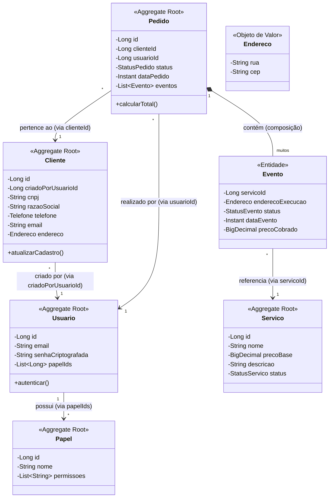

# Class Diagram

```mermaid
classDiagram
    class Usuario {
        <<Aggregate Root>>
        -Long id
        -String email
        -String senhaCriptografada
        -List~Long~ papelIds
        +autenticar()
    }

    class Papel {
        <<Aggregate Root>>
        -Long id
        -String nome
        -List~String~ permissoes
    }

    class Cliente {
        <<Aggregate Root>>
        -Long id
        -Long criadoPorUsuarioId
        -String cnpj
        -String razaoSocial
        -Telefone telefone
        -String email
        -Endereco endereco
        +atualizarCadastro()
    }

    class Pedido {
        <<Aggregate Root>>
        -Long id
        -Long clienteId
        -Long usuarioId
        -StatusPedido status
        -Instant dataPedido
        -List~Evento~ eventos
        +calcularTotal()
    }

    class Evento {
        <<Entidade>>
        -Long servicoId
        -Endereco enderecoExecucao
        -StatusEvento status
        -Instant dataEvento
        -BigDecimal precoCobrado
    }

    class Servico {
        <<Aggregate Root>>
        -Long id
        -String nome
        -BigDecimal precoBase
        -String descricao
        -StatusServico status
    }

    class Endereco {
        <<Objeto de Valor>>
        -String rua
        -String cep
    }

    Usuario "1" --> "*" Papel : possui (via papelIds)
    Cliente "*" --> "1" Usuario : criado por (via criadoPorUsuarioId)
    Pedido "*" --> "1" Usuario : realizado por (via usuarioId)
    Pedido "*" --> "1" Cliente : pertence ao (via clienteId)
    Pedido "1" *-- "muitos" Evento : contém (composição)
    Evento "*" --> "1" Servico : referencia (via servicoId)


```
