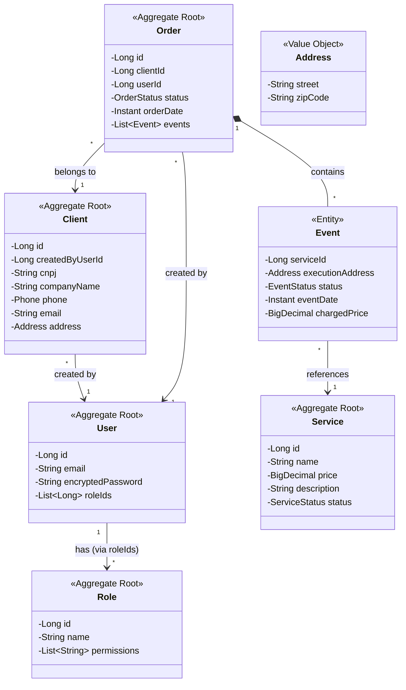

# Class Diagram

```mermaid
classDiagram
    class User {
        <<Aggregate Root>>
        -Long id
        -String email
        -String encryptedPassword
        -List~Long~ roleIds
    }

    class Role {
        <<Aggregate Root>>
        -Long id
        -String name
        -List~String~ permissions
    }

    class Client {
        <<Aggregate Root>>
        -Long id
        -Long createdByUserId
        -String cnpj
        -String companyName
        -Phone phone
        -String email
        -Address address
    }

    class Order {
        <<Aggregate Root>>
        -Long id
        -Long clientId
        -Long userId
        -OrderStatus status
        -Instant orderDate
        -List~Event~ events
    }

    class Event {
        <<Entity>>
        -Long serviceId
        -Address executionAddress
        -EventStatus status
        -Instant eventDate
        -BigDecimal chargedPrice
    }

    class Service {
        <<Aggregate Root>>
        -Long id
        -String name
        -BigDecimal price
        -String description
        -ServiceStatus status
    }

    class Address {
        <<Value Object>>
        -String street
        -String zipCode
    }

    User "1" --> "*" Role : has (via roleIds)
    Client "*" --> "1" User : created by
    Order "*" --> "1" User : created by
    Order "*" --> "1" Client : belongs to
    Order "1" *-- "*" Event : contains
    Event "*" --> "1" Service : references
```
