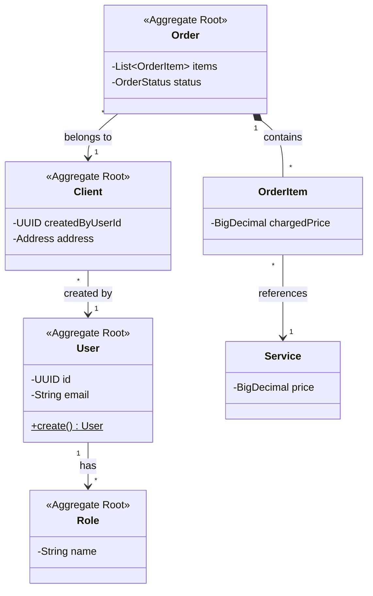

# ⚡ Speed Service API

⚠️ **Status do Projeto: Em Desenvolvimento (WIP)** > O core do domínio e as regras de negócio estão sendo implementados seguindo rigorosamente os princípios de Clean Architecture e DDD.

---

### 📄 1. O que é o projeto?
O **Speed Service API** é um motor de backend robusto desenvolvido em **Java 17**. Embora utilize o poder do ecossistema **Spring Boot** para injeção de dependências e exposição de endpoints, o projeto foi arquitetado sob os princípios da **Clean Architecture**. Isso significa que o núcleo da aplicação (regras de negócio e entidades) é **completamente desacoplado do framework**.

A ideia central é que o Spring funcione apenas como um "detalhe de infraestrutura", permitindo que o código de domínio seja independente, testável e facilmente adaptável a outras tecnologias no futuro. Todo o desenvolvimento é guiado por **DDD (Domain-Driven Design)** para refletir a realidade do negócio e **TDD (Test-Driven Development)** para garantir uma base de código livre de regressões.

### ✨ 2. O que o projeto faz?
A API orquestra o fluxo entre usuários e prestadores de serviço através das seguintes funcionalidades:
* **Gestão de Identidade:** Cadastro de usuários que podem gerenciar múltiplos perfis de clientes vinculados a uma única conta.
* **Fluxo de Contratação:** Permite a abertura de pedidos contendo diversos serviços em uma única transação (`OrderItem`).
* **Rastreabilidade de Dados:** Registra o histórico detalhado da transação, incluindo:
    * **Precificação:** Valor exato capturado no momento da contratação (Charged Price).
    * **Cronograma:** Registro da data de contratação e previsão de execução do serviço.
    * **Status Management:** Controle rigoroso dos estados do pedido (Pendente, Pago, Executado).
* **Validação de Domínio:** Aplica regras de negócio que impedem agendamentos retroativos ou valores inconsistentes (ex: preço mínimo de serviço).

### 🎯 3. Para quem ele é destinado?
* **Desenvolvedores Backend** que buscam uma referência de como implementar Clean Architecture na prática, mantendo o framework na periferia do sistema.
* **Empresas** que precisam de uma base sólida para sistemas de agendamento, reduzindo drasticamente o *time-to-market*.
* **Arquitetos de Software** interessados em ver a aplicação de conceitos como *Rich Domain Models* e desacoplamento total de infraestrutura.

---

## 🛠️ Roadmap de Desenvolvimento

O projeto está sendo construído seguindo uma estratégia **Inside-Out** (do núcleo para a periferia), garantindo que as regras de negócio sejam sólidas antes da exposição de qualquer interface externa.

- [x] **Setup e Arquitetura:** Inicialização do ecossistema Java 17/Spring Boot 3 e definição da estrutura de pastas.
- [ ] **Core de Domínio (WIP):** Implementação de Agregados, Entidades e *Value Objects* com lógica de autovalidação.
- [ ] **Camada de Aplicação:** Desenvolvimento dos Casos de Uso (*Use Cases*).
- [ ] **Adaptadores de Interface:** Implementação de *Controllers* REST e mapeamento de DTOs.
- [ ] **Infraestrutura e Persistência:** Configuração de Repositórios com Spring Data JPA e integração com base de dados.
- [ ] **Ecossistema Docker:** Orquestração completa via Docker Compose para ambiente de desenvolvimento e testes.

---

## 🏗️ Arquitetura e Modelagem de Dados

O **Speed Service API** utiliza os padrões do **DDD** para separar responsabilidades e garantir que o domínio seja rico e independente.

### 📍 Diagrama de Classe (Core do Sistema)
O diagrama abaixo ilustra as relações entre os principais Agregados do sistema *(visão macro)*:

