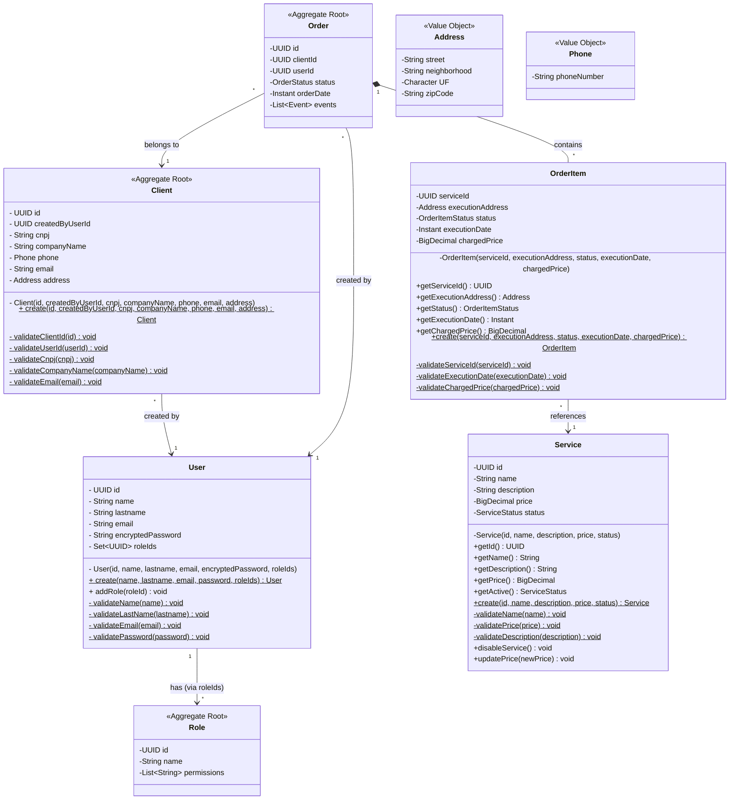

# Class Diagram

```mermaid
classDiagram
    class User {
        - UUID id
        - String name
        - String lastname
        - String email
        - String encryptedPassword
        - Set~UUID~ roleIds
        - User(id, name, lastname, email, encryptedPassword, roleIds)
        + create(name, lastname, email, password, roleIds) User$
        + addRole(roleId) void
        - validateName(name) void$
        - validateLastName(lastname) void$
        - validateEmail(email) void$
        - validatePassword(password) void$
    }    

    class Role {
        <<Aggregate Root>>
        -UUID id
        -String name
        -List~String~ permissions
    }

    class Client {
        <<Aggregate Root>>
        - UUID id
        - UUID createdByUserId
        - String cnpj
        - String companyName
        - Phone phone
        - String email
        - Address address
        - Client(id, createdByUserId, cnpj, companyName, phone, email, address)
        + create(id, createdByUserId, cnpj, companyName, phone, email, address) Client$
        - validateClientId(id) void$
        - validateUserId(userId) void$
        - validateCnpj(cnpj) void$
        - validateCompanyName(companyName) void$
        - validateEmail(email) void$
    }

    class Order {
        <<Aggregate Root>>
        -UUID id
        -UUID clientId
        -UUID userId
        -OrderStatus status
        -Instant orderDate
        -List~Event~ events
    }

    class OrderItem {
        -UUID serviceId
        -Address executionAddress
        -OrderItemStatus status
        -Instant executionDate
        -BigDecimal chargedPrice
        
        -OrderItem(serviceId, executionAddress, status, executionDate, chargedPrice)
        
        +getServiceId() UUID
        +getExecutionAddress() Address
        +getStatus() OrderItemStatus
        +getExecutionDate() Instant
        +getChargedPrice() BigDecimal
        
        +create(serviceId, executionAddress, status, executionDate, chargedPrice)$ OrderItem
        
        -validateServiceId(serviceId)$ void
        -validateExecutionDate(executionDate)$ void
        -validateChargedPrice(chargedPrice)$ void
    }

    class Service {
        -UUID id
        -String name
        -String description
        -BigDecimal price
        -ServiceStatus status
        -Service(id, name, description, price, status)
        +getId() UUID
        +getName() String
        +getDescription() String
        +getPrice() BigDecimal
        +getActive() ServiceStatus
        +create(id, name, description, price, status)$ Service
        -validateName(name)$ void
        -validatePrice(price)$ void
        -validateDescription(description)$ void
        +disableService() void
        +updatePrice(newPrice) void
    }

    class Address {
        <<Value Object>>
        -String street
        -String neighborhood
        -Character UF
        -String zipCode
    }

    class Phone {
        <<Value Object>>
        -String phoneNumber
    }

    User "1" --> "*" Role : has (via roleIds)
    Client "*" --> "1" User : created by
    Order "*" --> "1" User : created by
    Order "*" --> "1" Client : belongs to
    Order "1" *-- "*" OrderItem : contains
    OrderItem "*" --> "1" Service : references
```
