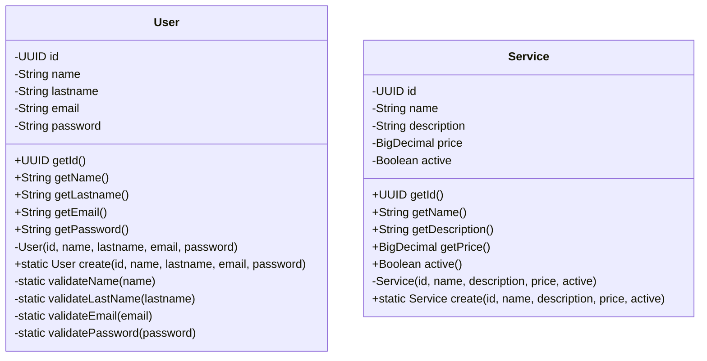

# Class Diagram

```mermaid
classDiagram
class User {
  -UUID id
  -String name
  -String lastname
  -String email
  -String password

  +UUID getId()
  +String getName()
  +String getLastname()
  +String getEmail()
  +String getPassword()

  -User(id, name, lastname, email, password)

  +static User create(id, name, lastname, email, password)

  -static validateName(name)
  -static validateLastName(lastname)
  -static validateEmail(email)
  -static validatePassword(password)
}

class Service {
  -UUID id
  -String name
  -String description
  -BigDecimal price
  -Boolean active

  +UUID getId()
  +String getName()
  +String getDescription()
  +BigDecimal getPrice()
  +Boolean active()

  -Service(id, name, description, price, active)
  +static Service create(id, name, description, price, active)
}
```
