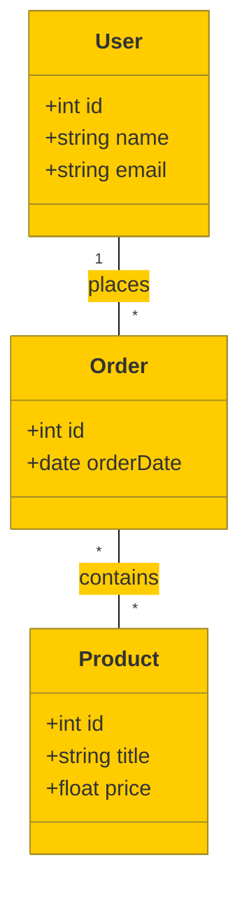

# Detailed Table Descriptions 

| Table Name | Description | Column Names | Column Descriptions |
|------------|-------------|--------------|---------------------|
| User       | Stores user information | id, name, email | id: Unique identifier for the user; name: User's name; email: User's email address |
| Product    | Stores product information | id, title, price | id: Unique identifier for the product; title: Name of the product; price: Product price |
| Order      | Stores order information | id, orderDate | id: Unique identifier for the order; orderDate: Date the order was placed |

## Logical Data Model

This diagram reflects the logical data model of the application, showing the relationship between users, products, and orders.